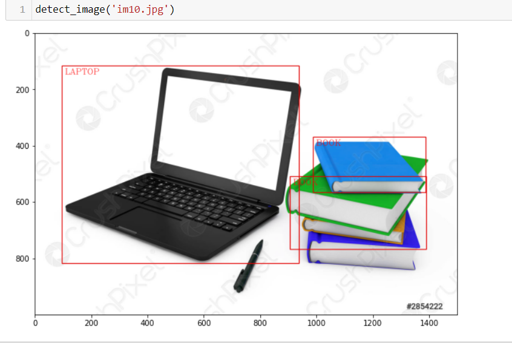
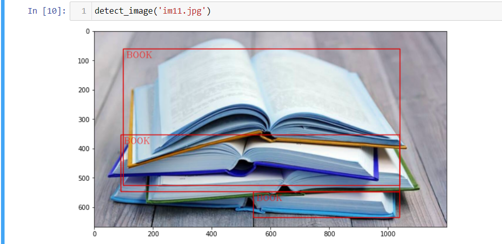

# object-detection-mobilenet
- What is object detection
    - Object detection is a computer vision technique that allows us to identify and locate objects in an image or video. With this kind of identification and localization, object detection can be used to count objects in a scene and determine and track their precise locations, all while accurately labeling them.

- Difference between image recognition and object detection
    -   Image recognition assigns a label to an image. A picture of a dog receives the label “dog”. A picture of two dogs, still receives the label “dog”. 
    -   Object detection, on the other hand, draws a box around each dog and labels the box “dog”. 
    

#IMAGE OBJECT DETECTION

#VIDEO OBJECT DETECTION

- Tools used
- Thank You
